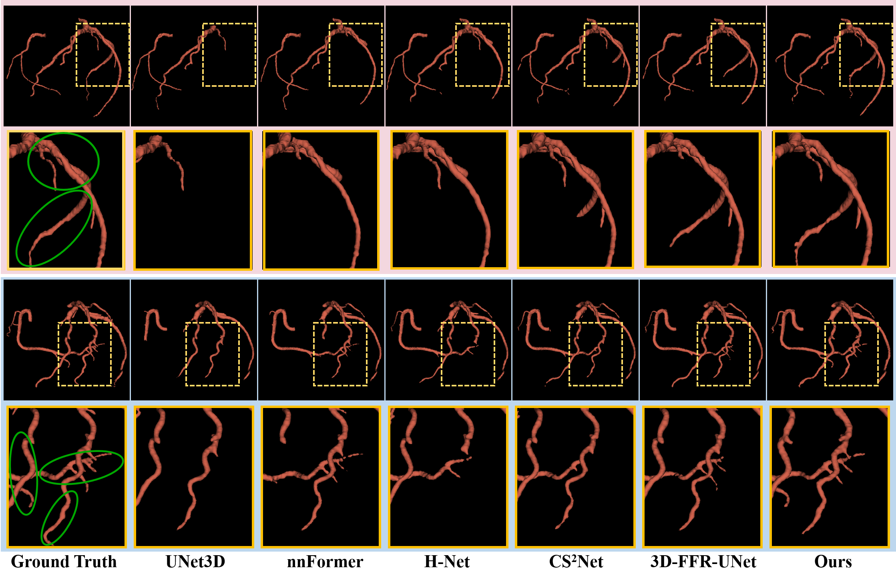

# FG-Net
High-quality coronary artery segmentation via fuzzy logic modeling coupled with dynamic graph convolutional network

**The proposed network is at**: `./model/fgnet_3d.py`

**Quantitative comparison** with state-of-the-art methods on the CTA119 dataset and the ASOCA dataset The best results are in bold, and the second-best results are underlined.

**Qualitative Comparison**: comparison of results for two typical cases from the ASOCA dataset by different methods.

**Usage**

**Data preparation**

**ASOCA dataset**:

https://asoca.grand-challenge.org

**data**
    ├── npy
    
        ├── img
        
            ├── 1.npy
            
            ├── 2.npy
            
            └── ...
            
        └── mask
        
            ├── 1.npy
            
            ├── 2.npy
            
            └── ...

**Training**

`python train.py`

**Testing**

`python test.py`

